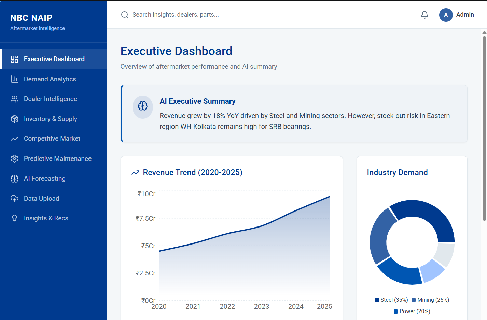
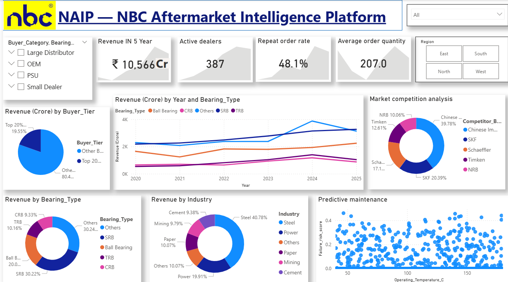
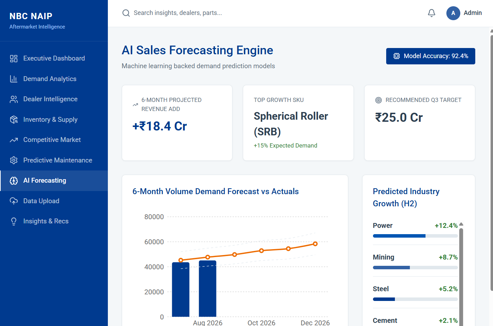
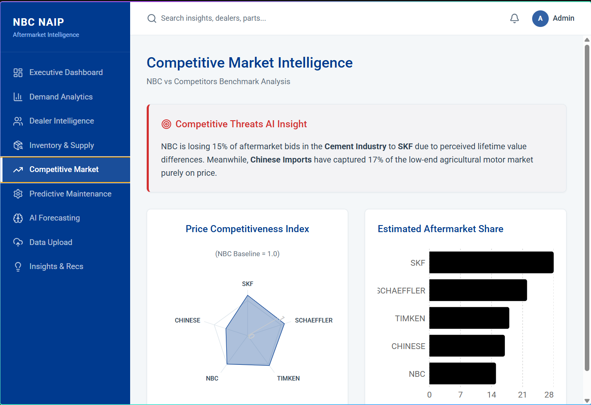

# NBC Aftermarket Intelligence Platform (NAIP)

AI-driven analytics for industrial bearing aftermarket operations.

---

## Overview

The NBC Aftermarket Intelligence Platform (NAIP) is a web-based analytics dashboard designed to help NBC Bearings make smarter decisions in the aftermarket business. It combines demand forecasting, dealer intelligence, inventory insights, and competitive analysis into one simple interface.

This project demonstrates how data-driven decision-making can improve forecasting accuracy, reduce stock-outs, and support better supply chain planning.

---

## Why this project matters

Industrial bearing aftermarket sales often face challenges such as:

- limited visibility into dealer-level demand
- difficulty predicting regional demand spikes
- inventory imbalance across warehouses
- pressure from competitor brands
- reactive maintenance and replacement planning

The platform helps address these issues with clear visual dashboards and business-focused insights.

---

## Key features

- Executive dashboard with revenue, dealer, and inventory metrics
- Demand analytics for regional and industry-level trends
- Dealer intelligence for repeat orders and performance monitoring
- Inventory and stock-out insights
- Competitive intelligence analysis
- Predictive maintenance insights for failure risk monitoring

---

## Screenshots

### Landing page


### Dashboard overview


### Demand insights


### Competitive intelligence


---

## Project structure

- `nbc-aftermarket-ai/` — main React + Vite frontend application
- `src/pages/` — app pages such as Dashboard, Demand Analytics, Dealer Intelligence, Inventory, and Predictive Maintenance
- `src/components/` — shared UI and layout components
- `src/data/` — mock data and demo content
- `NBC_dataset/` — example dataset used for analytics and forecasting scenarios
- `Dashboard/` — dashboard-related assets
- `Deployed Website` — deployment URL reference

---

## Tech stack

### Frontend
- React
- Vite
- CSS / modern UI components
- Recharts

### Data & analytics
- Python-based analytics workflows
- Pandas / NumPy
- Scikit-learn / XGBoost

---

## Dataset overview

This project uses a synthetic dataset that mirrors realistic aftermarket business behavior.

### Dataset size
- 3400+ rows
- 2020–2025 historical data
- 24+ analytical columns

### Sample fields
- Year, Month, Region, Industry
- Bearing type, sales channel, buyer category
- Revenue, lead time, inventory status
- Competitor brand and price index
- Failure risk and machine age

---

## Run locally

### Prerequisites
- Node.js 18+ installed

### Steps

```bash
cd nbc-aftermarket-ai
npm install
npm run dev
```

Then open:

- http://localhost:3000/

---

## Build for production

```bash
cd nbc-aftermarket-ai
npm run build
```

The production build output will be generated in the `dist/` folder.

---

## Deployment guide (Vercel)

This project is well suited for deployment on Vercel.

### Step-by-step

1. Push your project to GitHub.
2. Open Vercel and click "New Project".
3. Import your GitHub repository.
4. In the project settings, set the project root to:
   - `nbc-aftermarket-ai`
5. Set the build command to:
   - `npm run build`
6. Set the output directory to:
   - `dist`
7. Click "Deploy".
8. After deployment, Vercel will provide a live URL.

### Replace the placeholder deployment link

After your site is live, update the deployment reference in:

- `Deployed Website`
- `README.md`

with your own Vercel URL.

---

## Business impact

If deployed in a real aftermarket environment, this platform can help improve:

- forecasting accuracy
- inventory planning
- dealer performance visibility
- proactive maintenance decisions
- overall aftermarket revenue efficiency

---

## Future improvements

Possible next steps include:

- integration with real dealer POS data
- real-time inventory tracking
- IoT-based bearing condition monitoring
- a digital spare parts marketplace
